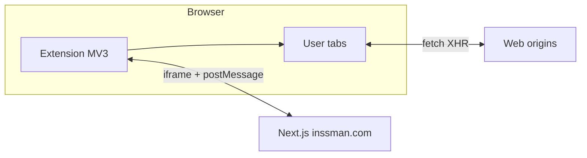

# Architecture

## 1. What Inssman is

Inssman is an **HTTP(S) mocking and interception** tool implemented as a **Chromium Manifest V3 extension**. Users define **rules** (redirect, block, modify headers, modify response, query params, inject files, modify request body, HTTP logger). Rules are persisted locally and applied through a mix of:

- **Declarative Net Request (DNR)** — for redirects, blocks, header/query changes, and parts of response modification.
- **Injected page-world scripts** — for `fetch` / `XHR` interception (request body and response body changes that must run in the page).

A **Next.js** site (`web/`) provides marketing pages, MDX-based user docs, and an **`/app` route** that embeds the extension’s options UI in an **iframe** when the extension is present—giving a “web dashboard” that is still backed by the extension’s local storage and service worker.

A small **Express** app (`server/`) is optional and used only for local HTTP demos (`GET`/`POST`); it is not part of the extension runtime.

## 2. System context (C4-style, container level)

- **Extension** runs in isolated extension contexts (service worker, options/popup pages, content-script-isolated worlds where used).
- **Page** runs site code; **MAIN** world injections run alongside the page (for interceptors and inject-file behavior).
- **Web app** does not store user rules in production by default; the “dashboard” experience depends on the extension injecting `window.INSSMAN` and messaging (see [LLD](./LLD.md)).

## 3. Browser extension architecture (conceptual)

If you come from **SPA development**, map extension pieces as follows:

| Extension concept | Web analogy |
|-------------------|-------------|
| **Service worker** (`serviceWorker.ts`) | Long-lived background “server” with no DOM; wakes on events |
| **Options page** (`options/`) | Full-screen admin UI (React + React Router hash routes) |
| **Popup** (`popup/`) | Small modal UI tied to toolbar icon |
| **Content scripts** | JS injected into web pages (here: setup bridge + registered `interceptor` bundle) |
| **`chrome.storage.local`** | Per-installation key-value store for rules and settings |
| **`chrome.runtime.sendMessage`** | RPC from UI pages to service worker |

### 3.1 Why both DNR and injected interceptors?

- **DNR** is efficient and reliable for **redirect**, **block**, **set/remove headers**, **query parameters**, and **static** response substitution where the platform API fits.
- **Page-world interception** is required when the product must **read or rewrite bodies** using `fetch`/XHR wrappers, because that logic must execute in the page’s JavaScript realm with access to the same globals the app uses.

The service worker coordinates **which rules exist**, **when to inject** rule data into the page (`InjectCodeService.injectRules`), and **when** to register the interceptor content script (`registerContentScripts`).

### 3.2 Web dashboard + iframe

For `https://inssman.com/app/*` (and local `http://localhost:3000/app/*`), a dedicated content script runs in **`world: MAIN`** (`iframeContentScript.ts`). It:

- Sets `window.INSSMAN.isExtensionInstalled = true` so the Next.js app can branch UI.
- Posts a message to ask the **isolated** setup script to resolve `chrome.runtime.getURL('options/options.html#...')` and inject a full-viewport **iframe** of the real options page.

Routing inside the iframe uses **hash routes**; when the inner app navigates, it can notify the parent to update the outer URL (`URLChanged` flow) for shareable paths.

Relevant constants: `NAMESPACE` / `INSSMAN`, `APP_URL` in [`browser-extension/src/options/constant/index.ts`](../browser-extension/src/options/constant/index.ts).

## 4. Data and privacy (architectural note)

- **Primary rule store**: `chrome.storage.local` on the user’s machine.
- **Analytics / error reporting**: optional services exist in dependencies (e.g. Amplitude, Mixpanel) and Firebase-related code paths; treat these as **product compliance** concerns when forking.
- **Firebase** in `web/` supports features like **shared recorded sessions** (Firestore / Storage); see [`web/src/config/firebase.ts`](../web/src/config/firebase.ts). Use env-based config for your own deployment (see [Deployment](./DEPLOYMENT.md)).

## 5. Security posture (high level)

- Rules can execute **user-supplied code** (dynamic modify response / request body). This is powerful and equivalent to running untrusted script in the target page’s origin when enabled—standard for this category of tool, but important for internal deployments.
- **`externally_connectable`** in `manifest.json` is broad (`ids: ["*"]` with http(s) matches). A fork intended for a single org should **narrow** this to known extension IDs and origins.

Details: [Security policy](../SECURITY.md).

## 6. Related reading

- [LLD — components and flows](./LLD.md)
- [Local development](./LOCAL_DEVELOPMENT.md)
- [Deployment](./DEPLOYMENT.md)
